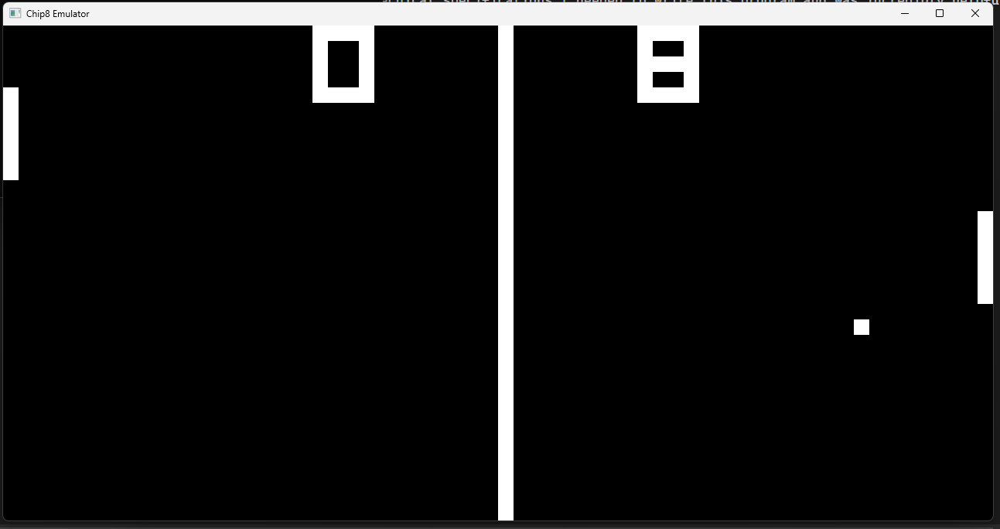
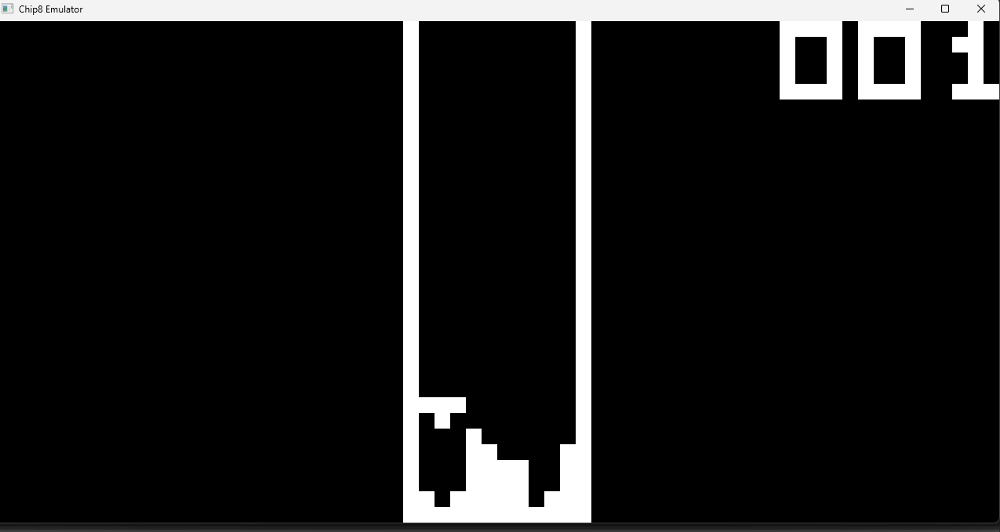
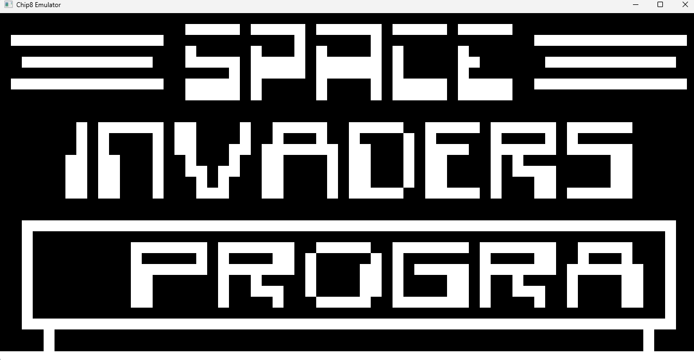
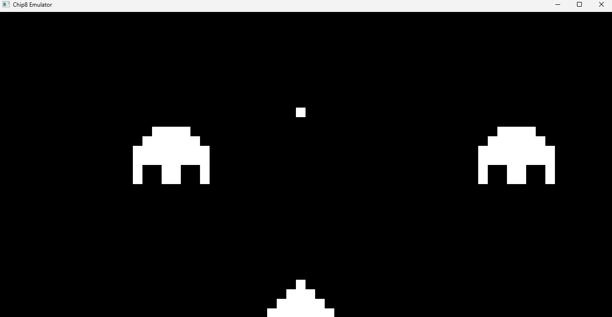

# Chip8

## Description
This project is an emulator for a Chip8 System written using C++ and SFML. Chip8 is a simple virtual machine and limited instruction set, making it an easy emulation project.
For more information about the system click <a href="https://en.wikipedia.org/wiki/CHIP-8">here</a>

## Usage
After compiling the source, simply execute: 
```bash
$ ./Chip8 [path_to_ROM]
```

## Screenshots
Here are some screenshots of this emulator: 

<p align="center">
  <b>Pong</b>
</p>
<p align="center">
    
</p>

<p align="center">
  <b>Tetris</b>
</p>
<p align="center">
    
</p>

<p align="center">
  <b>Space Invader</b>
</p>
<p align="center">
    
</p>
<p align="center">
    
</p>

## Links

This <a href="https://tobiasvl.github.io/blog/write-a-chip-8-emulator/">blog</a> provided all the techical specifications I needed to write this program and was incredibly helpful.  

Source for Chip8 ROMS: <a href="https://github.com/kripod/chip8-roms/tree/master/games">https://github.com/kripod/chip8-roms/tree/master/games</a>
